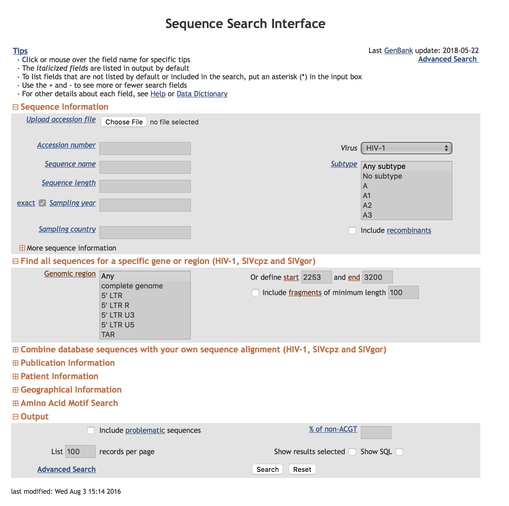
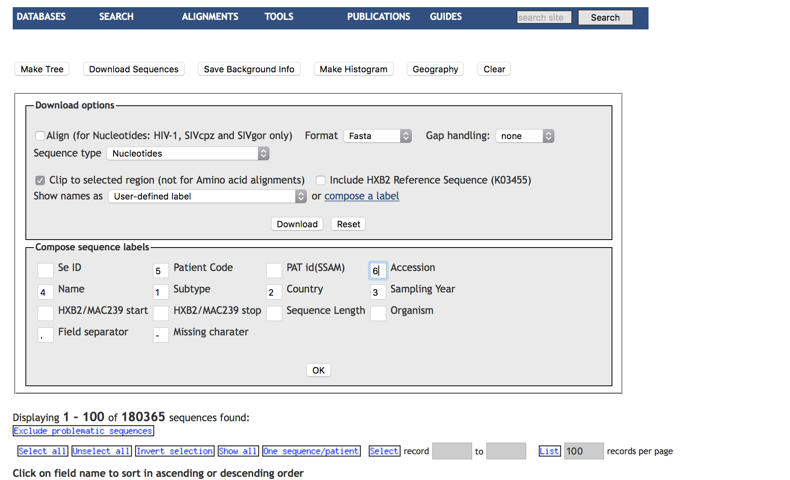

Analysis notes for _"National and International Dimensions of HIV-1 Sequence Clusters in a Northern California Clinical Cohort"_
==========

#### Obtaining reference data

We searched the HIV LANL database to include all HIV-1 sequencies covering all of PR and the first 200 (or more) aminoacids of RT. We excluded problematic sequences (which is the default setting) and selected one sequence per individual for download. We composed a custom label for sequence downloads. See attached screenshots.


**Figure 1. LANL Search Box**


**Figure 2. LANL Download Box**

The resulting file contained **140464** sequences and can be found in `data/raw_reference.fas`

#### Preparing sequence data 

The standard workflow for preparing the LANL file for consumption by `HIV-TRACE` is 

##### Step 1. Align all database sequences to the **same reference as will be used for KP data** using [bealign](https://github.com/veg/bioext)

By convention we use the `HXB2_prrt` reference sequence; this is the HBX2 strain's PR and RT. We also specify an HIV-specific scoring matrix (`HIV_BETWEEN_F`), from this [Nickle et al paper](http://journals.plos.org/plosone/article?id=10.1371/journal.pone.0000503). The command to align sequences is as follows (adjust path names accordingly, assumes `bealign` has been installed); this step takea about **25** minutes on a MacBook Pro (running in multi-threaded mode).

```
$bealign -r HXB2_prrt -m HIV_BETWEEN_F data/raw_reference.fas data/reference.bam 
```

##### Step 2. Convert the resulting file from BAM to FASTA 

Use the command (which is a part of the [BioExt](https://github.com/veg/bioext) package):

```
$bam2msa data/reference.bam data/reference-aligned.fas
```

We repeat the same steps for the `data/KP-naive.fas` dataset with the resulting files `data/kp-mapped.bam` and `data/kp-aligned.fas`. When invoking `bealign` on the `KP-naive.fas` file.

```
$bealign -r HXB2_prrt -m HIV_BETWEEN_F data/kp_naive.fas data/kp-mapped.bam 
$bam2msa data/kp-mapped.bam data/kp-aligned.fas
```

##### Step 3. 

Because some of the database sequences include those deposited by Stanford, we filter the reference database to **exclude** all the _blacklisted_ sequences contained in the file `data/stanford-accessions.csv` (second column) via the following command 

```
$python3 scripts/filter-accession-numbers-fas.py -i data/stanford-accessions.csv 
-f data/reference-aligned.fas > data/reference-aligned-filtered.fas
```

The resulting file with "clean" accession numbers is written to `data/reference-aligned-filtered.fas` and **excludes** `1404` sequences from the original download. The total number of sequences in this file is `139060` sequences.


#### Running the HIV-TRACE analyses

Next, we perform the combined KP and LANL HIV-TRACE analysis.

[Step 1] Computing pairwise TN93 distances using the `tn93` tool.

[Step 2] Inferring the transmission network using `hivnetworkcsv`

[Step 3] Incorporating external attributes for nodes from the TSV file

[Step 4] Summarizing the network using ancillary scripts

[Step 5] Visualizing the results using `hivtrace-viz`


#### Computing pairwise TN93 distances using the `tn93` tool.

Our suggested way to handle ambiguous data is as follows: **resolve** all two-way ambiguities to match their possible single character states, **average** all other ambiguites, **ignore** positions where either sequence has a gap, and **for ambiguity rich sequences** (>5% of bases are ambiguous), we **average** all resolutions. 


Other options provided to the analysis request that only sequences that have 500 or more aligned bases be compared and only distances of 1.5% or less be output to the CSV file.

We compute the pairwise distances using the [TN93](https://github.com/veg/tn93) tool.  

> Compute pairwise distsnces between all pairs of KP sequences and write those ≤1.5% to `results/kp-distances.csv`

```
$tn93 -a RYWSMK -g 0.05 -l 500 -t 0.015 -o results/kp-distances.csv data/kp-aligned.fas 
```

Overall run metrics are printed to the console (see below); in particular, **4151** pairs of sequences were linked at 1.5% or less genetic distance. 

```
	"Actual comparisons performed" :10362628,
	"Comparisons accounting for copy numbers " :1.03626e+07,
	"Total comparisons possible" : 10362628,
	"Links found" : 4151,
	"Maximum distance" : 0.164805,
	"Sequences" : 4553,
	"Mean distance" : 0.0611479
```

> Compute pairwise distsnces between all pairs of (KP, LANL) sequences and write those ≤1.5% to `results/kp-lanl.csv`

```
$tn93 -a RYWSMK -g 0.05 -l 500 -t 0.015 -o results/kp-lanl.csv 
-s data/reference-aligned-filtered.fas data/kp-aligned.fas 
```

This step takes approximately 3 minutes on a MacBook Pro (running in multithreaded mode)

Overall run metrics are printed to the console (see below), in particular, **9970** pairs of (KP, LANL) sequences were linked at 1.5% or less genetic distance. 

```
"Actual comparisons performed" :633140180,
	"Comparisons accounting for copy numbers " :6.3314e+08,
	"Total comparisons possible" : 633140180,
	"Links found" : 9970,
	"Maximum distance" : 0.427186,
	"Sequences in first file" : 4553,
	"Sequences in second file" : 139060,
	"Mean distance" : 0.085368,
```

> Compute pairwise distsnces between all pairs of LANL sequences and write those ≤1.0% to `results/lanl-lanl.csv`

This step takes approximately an hour on a MacBook Pro (running in multithreaded mode), since it performs close to 10 billion pairwise distance calculations. 

```
$tn93 -a RYWSMK -g 0.05 -l 500 -t 0.01 -o results/lanl-lanl.csv 
data/reference-aligned-filtered.fas 
```

Overall run metrics are printed to the console (see below), in particular, **588391** pairs of LANL sequences were linked at 1.0% or less genetic distance. 

```
	"Actual comparisons performed" :9668772270,
	"Comparisons accounting for copy numbers " :9.66877e+09,
	"Total comparisons possible" : 9668772270,
	"Links found" : 588391,
	"Maximum distance" : 0.682983,
	"Sequences" : 139060,
	"Mean distance" : 0.0976466,
```

#### Running hivnetworkcsv to infer transmission networks

We will use [hivnetworkcsv](https://github.com/veg/hivclustering/), which is a part of HIV-TRACE package, to infer the transmission network. 

The recommended set of options, which use **edge filtering** to consider all network triangles (A connected to B connected to C connected to A), and uses a phylogenetic test to remove one of the traingle edges if possible, and **mark** sequences that are in clusters with HXB2 as potential contaminants (in your case, because you have old sequences these clusters are probably real). Please note that the `data/hxb2.txt` file lists the name of the reference sequence used by `bealign` during the mapping stage; if you change the reference sequence there, you should also update this file.

We will also be excluding those clusters which contain LANL sequences (i.e. no KP isolates). In order to do so, we need to prepare a file that lists all KP sequence IDs (the whitelist); this can be done using the following command 

```
awk '/^\>/ {print substr($0,2);}' data/kp-aligned.fas > data/kp-ids.txt 
```

The following command takes about 8-10 hours to run on a MacBook Pro, with >99% of the time consumed by edge filtering. 

```
$ hivnetworkcsv -t 0.015 -j -i results/kp-distances.csv -i results/kp-lanl.csv 
-i results/lanl-lanl.csv -f plain -f plain -f plain -k data/kp-ids.txt 
-s data/kp-aligned.fas -s data/reference-aligned-filtered.fas 
-s data/reference-aligned-filtered.fas -n remove > results/network.json
```

The program will write progress messages to the screen along the lines of 

```
Included 405852 edges after applying node list filtering
Running edge filtering on 278 clusters with 3 or more edges
Filtering a set of 5946 edges (273/278 clusters). Pass 0, 32768 triangles, 1433 filtered edges                                   
...
...
```

conclude with the summary of actions performed,

```
Edge filtering identified 118231 edges for removal
Edge filtering removed 118231 edges
Fitting the degree distribution to various densities
```

and write the resulting network as a JSON file to `results/network.json`.

#### Adding external attributes to nodes

To annotate network with attributes that can be viewed and interacted with using `hivnetwork-viz`, and summarized with ancillary scripts, we will use a variety of simple Python scripts to extract sequence attributes from sequence names and CSV/TSV files. 

##### Annotating LANL data

The first order of business is to extract country and isolation year from LANL sequences. This is done in two steps

1). Extract year and country of isolation and the subtype from `.` delimited sequence names, like `C.IN.1993.93IN101.IN101.AB023804` 

2). Take advantage of additional information about the **9397** sequences from [PMID 15567861] (https://www.ncbi.nlm.nih.gov/pubmed/15567861), that are marked as having 'unknown' country in LANL, but are all 'US' based isolates (based on the provenance of the lab and personal communication from study authors).


```
$python3 scripts/extract-lanl-annotations.py 
-d results/kp-lanl.csv -d results/lanl-lanl.csv 
-i data/PMID-15567861-accessions.txt 1 'US' > data/lanl-annotations.tsv

```

The resulting file `data/lanl-annotations.tsv` looks like 

```
ID	Country	IsolateYear	Subtype
B.FR.1983.IIIB_LAI.LAI.A04321	FR	1983	B
B.JP.-.KI_560.KI_560.AB873942	JP	-	B
01_AE.VN.2009.09HT0038PRRT.-.AB895317	VN	2009	01_AE
B.US.-.33C.-.AF072959	US	-	B
B.IT.-.163.-.AF252022	IT	-	B...
```

##### Annotating the network nodes

Next, we "inject" attributes into the network JSON file using a series of calls to a Python script `scripts/inject-attributes.py`. There is a shell script `scripts/annotate-network.sh` which automates the repeated invokation of `scripts/inject-attributes.py` to store Year and Country into the network JSON file, as well as annotate each node with whether or not it came from KP or LANL ('Source'). We also annotate LANL sequences by subtype

```
sh scripts/annotate-network.sh results/network
```

#### Viewing the topology of inferred networks

Load the resulting **json** into the visualization into [veg.github.io/hivtrace-viz/plain.html](http://veg.github.io/hivtrace-viz/plain.html), using the `FILE` menu, to view the networks .JSON file. 

#### Partial analysis notebook

We have created an [ObservableHQ notebook](https://beta.observablehq.com/@spond/ncc-lanl-visualization) which pulls the `network.json` file from Dropbox and performs live analyis and figure generation of some of the descriptive text in the manuscript. 

#### Extracting individual clusters

A part of the analysis involves extracting indivudal clusters from the network, which can be done with the help of `scripts/extract-cluster.py`. For example, to extract the list of sequence IDs to cluster 2 (the large subtype B cluster to), we use 

```
$scripts/extract-cluster.py -j results/network.json -c 2
```

which outputs a long list sequence names to `stdout` 

```
B.ES.-.34_00.-.AY316019
B.AU.2007.99619831.99619831.KC238301
B.CN.2008.2008_ZheJiang_QZ08ZJ180_MTB.08ZJ180.KJ614180
B.-.2002.02_126855.-.EU608080
B.CN.2011.LS3349.LS3349.KT379174
B.JP.2010.E10-50910963-1.E10-50910963.AB866110
B.CN.2008.SQ9_4.-.GU345702
30155
...
```

This script can also extract sequences associated with clustered sequences, if it provided with the corresponding FASTA files, e.g., 

```
$python3 scripts/extract-cluster.py -j results/network.json -c 2 
-f data/kp-aligned.fas -f data/reference-aligned.fas
```

#### Subsetting clusters

In order to subsample larger clusters to enable faster phylogenetic analyses, please use the `scripts/thin-cluster.sh` shell script, which relies on `subset-cluster.py`, `scripts/extract-cluster.py`, `TN93`, and FASTTree (assumed to be installed and availabe via `PATH` environment variable) 

Use as follows to extract cluster `287` to directory `clusters/cluster287-AE` and thin in down to 200 sequences, including all NCC sequences

```
$sh scripts/thin-cluster.sh cluster287-AE 287 200 
```

The resulting direcoty will contain the following files:

```
ls -l clusters/cluster287-AE/
total 19352
-rw-r--r--@ 1 sergei  staff  4170544 Dec 12 15:13 dense-clusters.json 
-rw-r--r--@ 1 sergei  staff       81 Dec 12 15:13 ncc.txt
-rw-r--r--@ 1 sergei  staff  5175701 Dec 12 15:13 sequences.fas
-rw-r--r--@ 1 sergei  staff   331008 Dec 12 15:13 subset-200.fas
-rw-r--r--@ 1 sergei  staff    11566 Dec 12 15:13 subset-200.tree
```

|File|Contents|
|:--|:--|
| dense-clusters.json | A JSON files with all subclusters at 0.5% or less |
| ncc.txt | The list of NCC sequence IDs in the cluster |
| sequences.fas | FASTA sequences for all the members of this cluster |
| sequences-200.fas | FASTA sequences for the subsampled cluster|
| sequences-200.tree | FastTree tree in Newick format, based on the subsampled cluster|